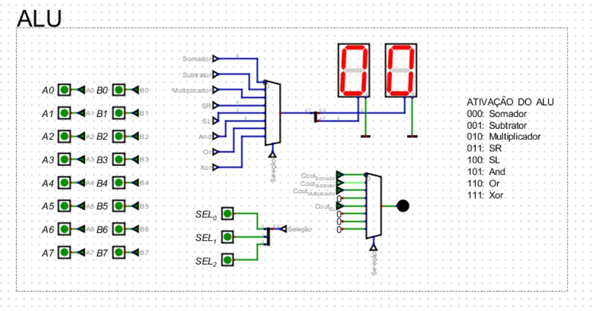
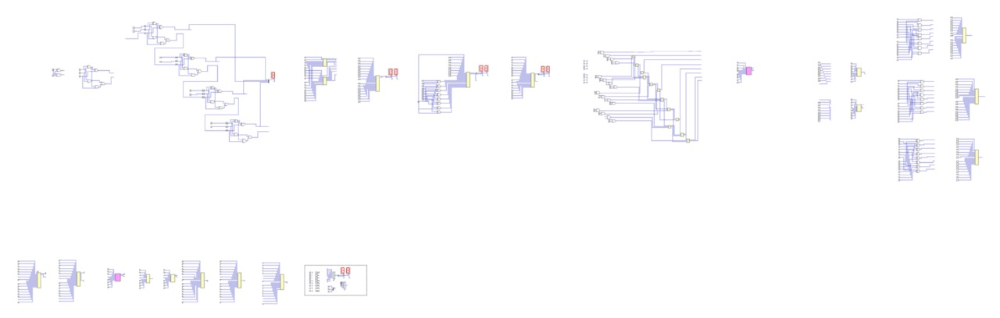

# Documentação da Unidade Lógica e Aritmética (ULA)

## 🎬 [Acesse o vídeo explicativo clicando aqui](#) 
<!-- Adicione o link para o seu vídeo explicativo aqui -->

## 📋 Sumário
1. [Introdução](#introdução)
2. [Visão Geral do Projeto](#visão-geral-do-projeto)
3. [Componentes da ULA](#componentes-da-ula)
   - [Operações Aritméticas](#operações-aritméticas)
   - [Operações de Deslocamento](#operações-de-deslocamento)
   - [Operações Lógicas](#operações-lógicas)
4. [Circuito Seletor](#circuito-seletor)
5. [Detecção de Overflow](#detecção-de-overflow)
6. [Display Hexadecimal](#display-hexadecimal)
7. [Testes e Validação](#testes-e-validação)
8. [Melhorias e Otimizações](#melhorias-e-otimizações)
9. [Conclusão](#conclusão)

## 📝 Introdução

Este projeto implementa uma Unidade Lógica e Aritmética (ULA) completa usando o simulador Digital. A ULA é o componente fundamental em sistemas computacionais responsável por realizar operações aritméticas e lógicas.

<div style="text-align: center; width: 800px; margin: 0 auto;">
    <h3>Figura 1: Imagem geral da Ula</h3>
    <div style="max-width: 800px; margin: 0 auto;">
        
    </div>
    <p><em>Fonte: Produzida pelo Autor (2025).</em></p>
</div>

## 🔭 Visão Geral do Projeto

Nossa ULA implementa 8 operações diferentes:
- **Operações Aritméticas**: Soma, subtração e multiplicação
- **Operações de Deslocamento**: Shift right e shift left
- **Operações Lógicas**: AND, OR e XOR

A seleção entre essas operações é feita através de 3 bits de controle (SEL0, SEL1, SEL2). O resultado é exibido em displays de 7 segmentos no formato hexadecimal, com um LED que indica situações de overflow.

## 🧩 Componentes da ULA

### Operações Aritméticas

#### Somador de 8 bits

**Funcionamento**: Utiliza full adders em cascata, onde cada full adder processa um par de bits e o carry do estágio anterior. O resultado é a soma dos operandos A e B, com possível carry out.

**Matriz de funcionamento**:
```
    Carry:  0 1 1 1 0 1 0
       A:   0 1 1 0 1 0 0 1
       B:   0 0 1 1 1 0 1 1
    ―――――――――――――――――――――――――
    Soma:   0 1 0 0 0 1 0 0
```

**Caso de teste**:
- A = 00101010 (42 decimal)
- B = 00010100 (20 decimal)
- Resultado esperado: 00111110 (62 decimal)

#### Subtrator de 8 bits

**Funcionamento**: Reutiliza o somador existente. Inverte os bits de B (complemento de 1) e adiciona 1 através do Carry In quando o sinal SUB é ativado, realizando a operação A - B = A + (~B + 1).

**Matriz de funcionamento**:
```
       A:   0 1 1 0 0 1 0 0  (100 decimal)
      ~B:   1 1 1 1 0 1 0 1  (complemento de 1 de 10)
     +1:                   1  (para formar complemento de 2)
    ―――――――――――――――――――――――――
Resultado:   0 1 0 1 1 0 1 0  (90 decimal)
```

**Caso de teste**:
- A = 01100100 (100 decimal)
- B = 00001010 (10 decimal)
- Resultado esperado: 01011010 (90 decimal)

#### Multiplicador de 4 bits

**Funcionamento**: Cria produtos parciais usando portas AND (cada bit de A × cada bit de B), desloca-os conforme a posição do bit de B, e soma todos usando half adders e full adders.

**Matriz de funcionamento**:
```
    0 1 1 0  (A = 6)
  × 0 1 1 1  (B = 7)
  ――――――――――
    0 1 1 0  (A × B0 = 6)
   0 1 1 0   (A × B1 = 6, deslocado 1 posição)
  0 1 1 0    (A × B2 = 6, deslocado 2 posições)
 0 0 0 0     (A × B3 = 0, deslocado 3 posições)
 ――――――――――
 0 0 1 0 1 0 1 0 (42 decimal)
```

**Caso de teste**:
- A = 0110 (6 decimal)
- B = 0111 (7 decimal)
- Resultado esperado: 00101010 (42 decimal)

### Operações de Deslocamento

#### Shift Right

**Funcionamento**: Cada bit move-se uma posição para a direita, o bit menos significativo é perdido, e o bit mais significativo recebe 0. Equivale à divisão por 2 (com arredondamento para baixo).

**Matriz de funcionamento**:
```
Entrada A:     1 0 1 0 1 0 1 0
               ↓ ↓ ↓ ↓ ↓ ↓ ↓ ↓
Shift Right: 0 1 0 1 0 1 0 1 _
```

**Caso de teste**:
- A = 10101010 (170 decimal)
- Resultado esperado: 01010101 (85 decimal)

#### Shift Left

**Funcionamento**: Cada bit move-se uma posição para a esquerda, o bit mais significativo é perdido (possível overflow), e o bit menos significativo recebe 0. Equivale à multiplicação por 2.

**Matriz de funcionamento**:
```
Entrada A:    0 1 0 1 0 1 0 1
              ↓ ↓ ↓ ↓ ↓ ↓ ↓ ↓
Shift Left: _ 1 0 1 0 1 0 1 0
```

**Caso de teste**:
- A = 01010101 (85 decimal)
- Resultado esperado: 10101010 (170 decimal)

### Operações Lógicas

#### Operação AND

**Funcionamento**: Compara bit a bit os operandos A e B. O resultado é 1 apenas onde ambos os bits correspondentes são 1.

**Matriz de funcionamento**:
```
     A: 1 1 1 1 0 0 0 0
     B: 0 0 1 1 1 1 0 0
   ――――――――――――――――――――
A AND B: 0 0 1 1 0 0 0 0
```

**Caso de teste**:
- A = 11110000 (240 decimal)
- B = 00111100 (60 decimal)
- Resultado esperado: 00110000 (48 decimal)

#### Operação OR

**Funcionamento**: Compara bit a bit os operandos A e B. O resultado é 1 onde pelo menos um dos bits correspondentes é 1.

**Matriz de funcionamento**:
```
    A: 1 0 1 0 1 0 1 0
    B: 0 1 0 1 0 1 0 1
  ――――――――――――――――――――
A OR B: 1 1 1 1 1 1 1 1
```

**Caso de teste**:
- A = 10101010 (170 decimal)
- B = 01010101 (85 decimal)
- Resultado esperado: 11111111 (255 decimal)

#### Operação XOR

**Funcionamento**: Compara bit a bit os operandos A e B. O resultado é 1 onde os bits correspondentes são diferentes (um 0 e um 1).

**Matriz de funcionamento**:
```
     A: 1 1 0 0 1 1 0 0
     B: 1 0 1 0 1 0 1 0
   ――――――――――――――――――――
A XOR B: 0 1 1 0 0 1 1 0
```

**Caso de teste**:
- A = 11001100 (204 decimal)
- B = 10101010 (170 decimal)
- Resultado esperado: 01100110 (102 decimal)

## 🔀 Circuito Seletor

**Funcionamento**: Um multiplexador 8:1 de 8 bits seleciona qual resultado de operação será direcionado para a saída, com base nos 3 bits de seleção (SEL2, SEL1, SEL0).

| SEL[2:0] | Operação     |
|----------|--------------|
| 000      | Somador      |
| 001      | Subtrator    |
| 010      | Multiplicador|
| 011      | Shift Right  |
| 100      | Shift Left   |
| 101      | AND          |
| 110      | OR           |
| 111      | XOR          |

## ⚠️ Detecção de Overflow

**Funcionamento**: Um multiplexador seleciona o sinal de overflow apropriado para cada operação. Cada operação tem sua própria condição de overflow:

- **Somador/Subtrator**: Avalia o carry entre os bits mais significativos
- **Multiplicador**: Verifica se bits 4-7 contêm informação (para multiplicação 4×4 bits)
- **Shift Left**: Detecta se o bit mais significativo original era 1
- **Outras operações**: Não geram overflow

**Caso de teste**:
- Operação: Somador (000)
- A = 01111111 (127 decimal)
- B = 00000001 (1 decimal)
- Resultado: 10000000 (overflow detectado, LED aceso)

## 🔢 Display Hexadecimal

**Funcionamento**: O resultado de 8 bits é dividido em dois dígitos hexadecimais (4 bits cada) e exibido em dois displays de 7 segmentos.

**Processo**:
1. Divisão: Bits 7-4 → Display esquerdo, Bits 3-0 → Display direito
2. Decodificação: Cada grupo de 4 bits é convertido para o formato de 7 segmentos
3. Exibição: O resultado aparece em hexadecimal (00-FF)

**Caso de teste**:
- Resultado da ULA: 10101010 (binário)
- Display esperado: "AA" (hexadecimal)

## ✅ Testes e Validação

A ULA foi testada com diferentes combinações de entradas para cada operação. Os testes confirmaram o funcionamento correto de:
- Todas as operações aritméticas, lógicas e de deslocamento
- Circuito seletor e multiplexação
- Detecção de overflow
- Exibição em display hexadecimal

Os resultados observados corresponderam aos valores calculados teoricamente, validando o projeto.

## 🛠️ Melhorias e Otimizações

Principais otimizações implementadas:
1. **Uso de barramentos**: Redução de 64 conexões individuais para 8 barramentos
2. **Multiplexador unificado**: Um único multiplexador de 8 bits em vez de 8 multiplexadores individuais
3. **Reaproveitamento do somador**: O subtrator utiliza o mesmo circuito do somador
4. **Detecção específica de overflow**: Cada operação tem seu detector apropriado

## 🏁 Conclusão

Este projeto demonstrou com sucesso a implementação de uma ULA completa, aplicando princípios fundamentais de circuitos digitais. A ULA combina operações aritméticas, lógicas e de deslocamento em um único componente com uma interface de seleção unificada.

A estrutura modular e as otimizações implementadas resultaram em um circuito eficiente e de fácil compreensão, que serve como excelente exemplo didático dos fundamentos da computação digital.

<div style="text-align: center; width: 800px; margin: 0 auto;">
    <h3>Figura 2: Imagem geral do desenvolvimento da Ula</h3>
    <div style="max-width: 800px; margin: 0 auto;">
        
    </div>
    <p><em>Fonte: Produzida pelo Autor (2025).</em></p>
</div>